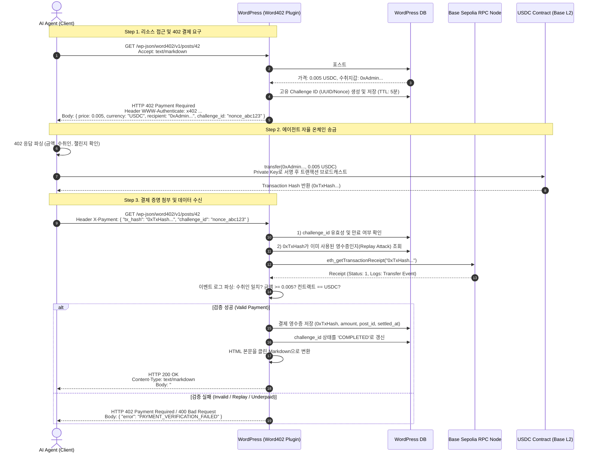

# 📐 [DOCS 01] 시스템 아키텍처 및 시퀀스 설계서
> **프로젝트명**: Word402 (WordPress x402 Agentic Monetization Plugin)  
> **문서 버전**: v1.0  
> **작성일**: 2026-09-09  
> **작성자**: Tech Lead (AI Assistant)

---

## 1. 시스템 개요 및 레이어 구조 (System Overview)

`Word402`는 워드프레스 코어 엔진을 수정하지 않고, 표준 워드프레스 플러그인 훅(Hook)과 REST API 인프라를 활용하여 **AI 에이전트 전용 무인 결제 게이트웨이**를 구현합니다.

```
┌────────────────────────────────────────────────────────────────────────┐
│                        AI Agent Client (Python/TS)                     │
│               - HTTP Client (Requests / Axios / Pay-wrapper)           │
│               - Local Web3 Keyring (Base Sepolia Private Key)          │
└───────────────────────────────────▲────────────────────────────────────┘
                                    │ HTTP Requests / JSON Responses
                                    ▼
┌────────────────────────────────────────────────────────────────────────┐
│                    WordPress Environment (Host Server)                 │
│                                                                        │
│  ┌──────────────────────────────────────────────────────────────────┐  │
│  │ 1. Request Interceptor & Content Negotiator Layer                │  │
│  │    - Hooks: rest_pre_dispatch, template_redirect                 │  │
│  │    - Agent Classifier (Headers, Accept: text/markdown, User-Agent)│  │
│  └──────────────────────────────────┬───────────────────────────────┘  │
│                                     ▼                                  │
│  ┌──────────────────────────────────────────────────────────────────┐  │
│  │ 2. x402 Protocol Handler & Challenge Generator                  │  │
│  │    - 402 Payment Required Response Builder                       │  │
│  │    - Challenge Nonce Issue & Expiration Management               │  │
│  │    - X-Payment Header Parser                                     │  │
│  └──────────────────────────────────┬───────────────────────────────┘  │
│                                     ▼                                  │
│  ┌──────────────────────────────────────────────────────────────────┐  │
│  │ 3. On-Chain Verification & Settlement Engine                     │  │
│  │    - Direct JSON-RPC Client (cURL / wp_remote_post)              │  │
│  │    - ERC-20 Transfer Log Parser (Amount, Recipient, Sender)      │  │
│  │    - Anti-Replay Cache & Receipt Validator                       │  │
│  └──────────────────────────────────┬───────────────────────────────┘  │
│                                     ▼                                  │
│  ┌──────────────────────────────────────────────────────────────────┐  │
│  │ 4. Content Transformer & Serving Engine                          │  │
│  │    - HTML-to-Markdown Clean Parser (Strip Ads/Nav/Footer)        │  │
│  │    - Teaser / Full-content Switcher                              │  │
│  └──────────────────────────────────┬───────────────────────────────┘  │
│                                     ▼                                  │
│  ┌──────────────────────────────────────────────────────────────────┐  │
│  │ 5. Data & Storage Layer (WordPress DB)                           │  │
│  │    - wp_x402_challenges / wp_x402_receipts / wp_x402_pricing     │  │
│  └──────────────────────────────────────────────────────────────────┘  │
└───────────────────────────────────▲────────────────────────────────────┘
                                    │ JSON-RPC (eth_getTransactionReceipt)
                                    ▼
┌────────────────────────────────────────────────────────────────────────┐
│                     Base Sepolia Network (EVM L2)                      │
│     - RPC Node: Alchemy / QuickNode / Public Base Sepolia Node         │
│     - USDC Smart Contract: ERC-20 Transfer (Agent -> WP Owner)        │
└────────────────────────────────────────────────────────────────────────┘
```

---

## 2. 워드프레스 생명주기 및 훅 인터셉터 (Lifecycle & Hook Strategy)

워드프레스의 표준 실행 사이클 내에서 클라이언트 요청을 효율적으로 가로채기 위해 2가지 주요 훅을 사용합니다.

```
[클라이언트 요청 수신]
       │
       ▼
[wp-settings.php 로드] ──> [word402_init] (플러그인 옵션, DB 스키마 로드)
       │
       ▼
   요청 종류 판별
  ┌────┴───────────────────────────┐
  │ [REST API 요청]                │ [웹 브라우저 일반 웹 요청]
  │ (/wp-json/word402/v1/...)      │ (/posts/{slug} or ?p=123)
  ▼                                ▼
[rest_pre_dispatch 훅]            [template_redirect 훅]
  │                                │
  ├─> Accept 헤더 검사              ├─> User-Agent / Accept 헤더 검사
  │   - application/json           │   - text/markdown 요청 시 가로챔
  │   - text/markdown              │   - 일반 브라우저(HTML)는 본문 필터링
  ▼                                ▼
[Word402_Paywall_Guard 실행] <─────┘
  │
  ├─ 1. 유료 설정된 글인지 확인 (wp_x402_pricing or post_meta)
  │     └─ 무료 글이면: 즉시 pass (200 OK)
  │
  ├─ 2. 요청 헤더에 `X-Payment` 영수증이 있는가?
  │     ├─ 없음: HTTP 402 Payment Required 반환 후 즉시 die()
  │     └─ 있음: 온체인 트랜잭션 검증 모듈로 패스
  │
  ├─ 3. 영수증 온체인 검증 (RPC 조회)
  │     ├─ 실패 (금액 부족/오송금/중복): HTTP 402/400 반환 후 die()
  │     └─ 성공: 영수증 DB 기록 및 본문 서빙 권한 부여
  ▼
[Word402_Content_Transformer 실행]
  │
  └─> HTML 제거 -> Markdown 정제 -> 클린 텍스트 반환 (200 OK)
```

---

## 3. 엔드-투-엔드 결제 시퀀스 (Detailed Sequence Diagram)



---

## 4. 보안 및 Replay Attack 방어 아키텍처

AI 에이전트가 단 한 번의 결제로 생성된 트랜잭션 해시를 재사용하여 여러 번 글을 읽거나, 타인의 트랜잭션을 가로채서 사용하는 것을 차단하기 위해 **3중 방어 메커니즘**을 적용합니다.

1. **단회성 챌린지 넌스 (One-Time Challenge Nonce)**:
   - 플러그인은 402 응답마다 고유한 `challenge_id`를 발행하고 만료시간(기본 300초 = 5분)을 부여합니다.
   - 만료된 챌린지로 들어온 결제는 유효한 온체인 트랜잭션이라도 거절됩니다.
2. **트랜잭션 해시 중복 검증 (Idempotent Transaction Ledger)**:
   - 성공적으로 검증된 트랜잭션 해시는 즉시 `wp_x402_receipts` 테이블의 Primary Key로 저장됩니다.
   - 이미 DB에 존재하는 트랜잭션 해시로 재요청이 들어오면 `ALREADY_USED_TRANSACTION` 에러를 반환합니다.
3. **블록체인 이벤트 엄격 검증 (Strict Event Log Filtering)**:
   - 단순 트랜잭션 성공(`status == 1`)만 보지 않고, 내부 `Transfer(address from, address to, uint256 value)` 이벤트를 엄격하게 디코딩합니다.
   - `to` 주소가 블로그 운영자 주소와 정확히 일치하는지, `value`가 해당 글의 요구 금액 이상인지, 토큰 주소가 공식 Base Sepolia USDC 컨트랙트인지 모두 일치해야만 최종 승인합니다.

---

## 5. 멀티체인 확장성 고려 (Chain Adapter Pattern)

초기 MVP는 **Base Sepolia (EVM)**를 기본으로 구현하지만, 시스템 아키텍처는 향후 **Solana** 또는 타 L2 체인 확장이 용이하도록 인터페이스 기반 어댑터 패턴을 적용합니다.

```php
interface Word402_Chain_Adapter {
    public function get_network_name(): string;
    public function verify_payment(string $tx_signature, string $expected_recipient, float $expected_amount, string $token_type): bool;
}

class Base_Sepolia_Adapter implements Word402_Chain_Adapter { ... }
class Solana_Devnet_Adapter implements Word402_Chain_Adapter { ... }
```
이로써 워드프레스 관리자가 차후 토글 스위치 하나로 결제망을 Base 또는 Solana로 손쉽게 전환할 수 있는 유연한 구조를 확보합니다.
