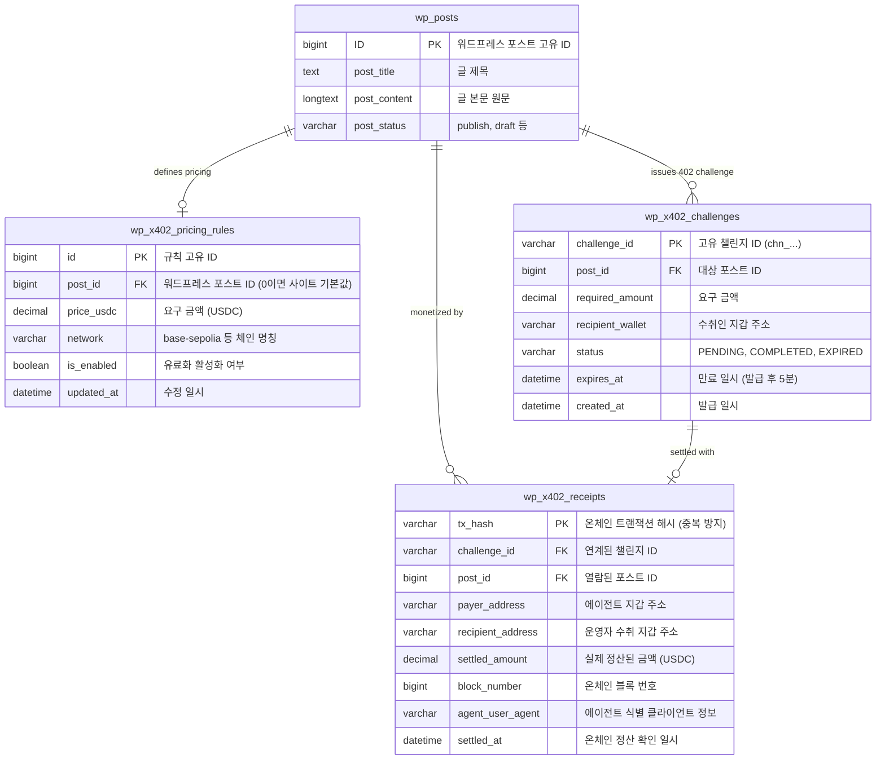

# 🗄️ [DOCS 03] 데이터베이스 스키마 및 ERD 설계서
> **프로젝트명**: Word402 (WordPress x402 Agentic Monetization Plugin)  
> **문서 버전**: v1.0  
> **작성일**: 2026-09-09  
> **DB 엔진**: MySQL 8.0 / MariaDB 10.4+ (WordPress $wpdb 호환)

---

## 1. 데이터 모델 개요 (Data Modeling Strategy)

`Word402` 플러그인은 워드프레스 코어의 핵심 테이블(`wp_posts`, `wp_options`)과 긴밀하게 연동되면서도, 온체인 트랜잭션의 특수성(Replay 방지, 결제 챌린지 생명주기 관리, 수수료 정산 통계)을 완벽히 격리하여 처리하기 위해 **3개의 전용 커스텀 테이블**을 구성합니다.



---

## 2. 테이블 상세 정의 및 DDL (Data Definition Language)

### 2.1. 가격 정책 테이블 (`wp_x402_pricing_rules`)
포스트별, 카테고리별 또는 전역(Global) 유료화 단가를 관리합니다.

```sql
CREATE TABLE IF NOT EXISTS `wp_x402_pricing_rules` (
  `id` BIGINT UNSIGNED NOT NULL AUTO_INCREMENT,
  `post_id` BIGINT UNSIGNED NOT NULL DEFAULT 0 COMMENT '0인 경우 전역(Global) 기본 요금',
  `price_usdc` DECIMAL(18, 6) NOT NULL DEFAULT 0.005000 COMMENT '포스트 열람 단가 (USDC 단위)',
  `network` VARCHAR(32) NOT NULL DEFAULT 'base-sepolia' COMMENT '결제 대상 블록체인 네트워크',
  `is_enabled` TINYINT(1) NOT NULL DEFAULT 1 COMMENT '1: 유료 활성화, 0: 무료 공개',
  `created_at` DATETIME NOT NULL DEFAULT CURRENT_TIMESTAMP,
  `updated_at` DATETIME NOT NULL DEFAULT CURRENT_TIMESTAMP ON UPDATE CURRENT_TIMESTAMP,
  PRIMARY KEY (`id`),
  UNIQUE KEY `idx_post_id` (`post_id`)
) ENGINE=InnoDB DEFAULT CHARSET=utf8mb4 COLLATE=utf8mb4_unicode_ci;
```

---

### 2.2. 결제 챌린지 테이블 (`wp_x402_challenges`)
에이전트에게 402 응답을 줄 때 발급되는 단회성 결제 요청(Challenge)을 추적하며, 유효기간(TTL 5분)을 관리합니다.

```sql
CREATE TABLE IF NOT EXISTS `wp_x402_challenges` (
  `challenge_id` VARCHAR(64) NOT NULL COMMENT '서버가 생성한 고유 챌린지 ID (예: chn_uuid)',
  `post_id` BIGINT UNSIGNED NOT NULL COMMENT '결제 대상 포스트 ID',
  `required_amount` DECIMAL(18, 6) NOT NULL COMMENT '요구 금액 (USDC)',
  `recipient_wallet` VARCHAR(66) NOT NULL COMMENT '결제받을 운영자 지갑 주소',
  `status` ENUM('PENDING', 'COMPLETED', 'EXPIRED') NOT NULL DEFAULT 'PENDING' COMMENT '결제 진행 상태',
  `expires_at` DATETIME NOT NULL COMMENT '챌린지 만료 일시 (발급 시점 + 300초)',
  `created_at` DATETIME NOT NULL DEFAULT CURRENT_TIMESTAMP,
  PRIMARY KEY (`challenge_id`),
  KEY `idx_post_status` (`post_id`, `status`),
  KEY `idx_expires_at` (`expires_at`)
) ENGINE=InnoDB DEFAULT CHARSET=utf8mb4 COLLATE=utf8mb4_unicode_ci;
```

---

### 2.3. 온체인 결제 영수증 테이블 (`wp_x402_receipts`)
온체인에서 성공적으로 검증 완료된 영수증 원장입니다. **`tx_hash`가 Primary Key로 지정되어 있어 동일한 트랜잭션 영수증을 재사용하는 공격(Replay Attack)을 DB 레벨에서 완벽 차단**합니다.

```sql
CREATE TABLE IF NOT EXISTS `wp_x402_receipts` (
  `tx_hash` VARCHAR(66) NOT NULL COMMENT '온체인 트랜잭션 해시 (EVM: 0x66글자)',
  `challenge_id` VARCHAR(64) NOT NULL COMMENT '매칭된 챌린지 ID',
  `post_id` BIGINT UNSIGNED NOT NULL COMMENT '구매 완료된 포스트 ID',
  `payer_address` VARCHAR(66) NOT NULL COMMENT '지불한 에이전트 지갑 주소',
  `recipient_address` VARCHAR(66) NOT NULL COMMENT '수취한 운영자 지갑 주소',
  `settled_amount` DECIMAL(18, 6) NOT NULL COMMENT '실제 온체인 전송된 USDC 수량',
  `block_number` BIGINT UNSIGNED NOT NULL DEFAULT 0 COMMENT '트랜잭션이 포함된 블록 번호',
  `agent_user_agent` VARCHAR(255) NULL COMMENT '에이전트 User-Agent 및 식별자',
  `settled_at` DATETIME NOT NULL DEFAULT CURRENT_TIMESTAMP COMMENT '정산 검증 완료 일시',
  PRIMARY KEY (`tx_hash`),
  KEY `idx_post_id` (`post_id`),
  KEY `idx_payer` (`payer_address`),
  KEY `idx_settled_at` (`settled_at`)
) ENGINE=InnoDB DEFAULT CHARSET=utf8mb4 COLLATE=utf8mb4_unicode_ci;
```

---

## 3. 워드프레스 옵션 스키마 (`wp_options`)

플러그인 전반의 글로벌 환경설정 값은 워드프레스 표준인 `wp_options` 테이블에 직렬화된 JSON 또는 개별 Key-Value로 저장됩니다.

| Option Name | 타입 및 예시값 | 설명 |
| :--- | :--- | :--- |
| `word402_admin_wallet` | `0x71C...B29` | 사이트 운영자의 Base 수취 지갑 주소 |
| `word402_network` | `base-sepolia` | 활성화된 블록체인 네트워크 ID |
| `word402_rpc_url` | `https://sepolia.base.org` | 온체인 검증용 JSON-RPC 노드 주소 |
| `word402_usdc_contract`| `0x036CbD53842c5426634...` | Base Sepolia 공식 USDC 컨트랙트 주소 |
| `word402_default_price`| `0.005` | 포스트 기본 열람 단가 (USDC) |
| `word402_challenge_ttl`| `300` | 챌린지 유효시간 (초 단위, 기본 5분) |
| `word402_enable_markdown`| `true` | AI 에이전트 요청 시 클린 Markdown 변환 서빙 여부 |

---

## 4. 데이터 보존 및 정리 정책 (Data Pruning Policy)

* **만료된 챌린지(Challenges) 자동 정리**:
  * 결제되지 않고 만료된 `PENDING` 상태의 레코드는 워드프레스 크론(`wp_schedule_event`)을 통해 24시간마다 자동 삭제하여 DB 비대화를 방지합니다.
* **영수증(Receipts) 영구 보존**:
  * `wp_x402_receipts` 테이블은 결제 증빙 및 수익 통계의 원장이므로 영구 보존하며, 관리자가 CSV로 추출(Export)할 수 있도록 지원합니다.
