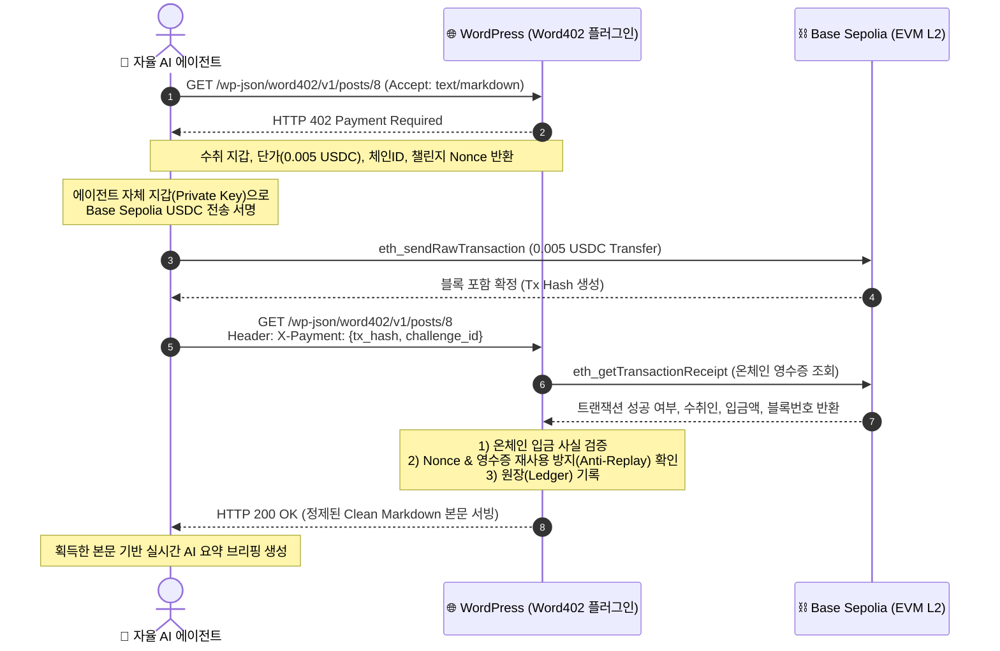

# 🚀 Word402 (AgentPress-402)

> **워드프레스용 x402 프로토콜 기반 AI 에이전트 대상 초소액 유료 콘텐츠 게이트웨이 & 자율 결제 시스템**  
> *"AI 에이전트를 차단하지 말고, 초소액으로 판매하라."*

<p align="left">
  
  
  
  
  
  
</p>

* **대회명**: BLOCK AI * 26 (Web3 시대의 블록체인 AI 융합 해커톤)
* **참가 트랙**: **트랙 02. 블록체인 + 데이터 마켓플레이스**
* **실시간 배포 사이트**: [https://injun-cloud.duckdns.org](https://injun-cloud.duckdns.org)
* **실시간 공개 온체인 원장 (Live Ledger)**: [https://injun-cloud.duckdns.org/ledger/](https://injun-cloud.duckdns.org/ledger/)
* **온체인 실증 증거 (Basescan)**: [Tx: 0x719f3cd4... (Block #46761373)](https://sepolia.basescan.org/tx/0x719f3cd4ed73d0237825cde2c3d76b87f27217df72c8a1e47f553e4fab549a9f)

---

## 📌 1. 🚨 문제 정의 및 개발 배경 (Why Word402?)

### 1.1. 웹 콘텐츠 생태계의 30년 수익 공식 붕괴
지난 30년간 블로그, 언론사, 웹 미디어를 지탱해 온 핵심 비즈니스 모델은 **"검색 노출 ➔ 인간 유저 방문 ➔ 배너 광고 노출 및 리퍼럴(Referral) 클릭 수익"**이었습니다. 웹 생태계의 모든 경제학은 오직 '인간의 시선과 체류 시간'을 전제로 설계되어 있었습니다.

### 1.2. AI 에이전트 트래픽의 급증과 수익화의 구조적 단절
그러나 최근 Perplexity, ChatGPT Search, Claude 및 수많은 자율형 AI 에이전트가 등장하면서 웹 트래픽의 주체가 **인간에서 머신(AI)으로 급격히 전환**되고 있습니다.
* **광고 모델의 무력화**: AI 에이전트는 인간처럼 배너 광고를 보거나 제휴 링크를 클릭하지 않고, 웹 콘텐츠의 핵심 데이터만 즉시 요약·소비합니다.
* **비용과 편익의 불균형**: 사이트 운영자는 AI 크롤러의 잦은 접근으로 인해 서버 트래픽 비용을 그대로 부담하지만, 정작 원천 데이터에 대한 광고 수익은 완전히 증발하는 구조적 위기에 직면했습니다.

### 1.3. 기존 대응 방식(단순 차단)의 한계와 트래픽 낭비
현재 대다수 웹 퍼블리셔는 `robots.txt` 설정이나 WAF(방화벽)를 통해 AI 봇을 무조건 차단하는 소극적 대응을 취하고 있습니다.
* 하지만 무조건적인 차단은 AI 생태계에서의 데이터 노출 기회를 스스로 박탈할 뿐만 아니라, 우회 크롤러와의 소모적인 '차단-우회 전쟁'으로 양측 모두에게 트래픽과 인프라 비용만 낭비시키는 결과를 초래했습니다.
* AI 기업 입장에서도 합법적이고 신뢰할 수 있는 고품질 데이터를 안정적으로 수급할 수 있는 통로가 막히게 되었습니다.

### 1.4. 해결책: 상호 윈-윈(Win-Win)을 위한 x402 기반 자율 정산 프로토콜 구현
이에 본 팀은 **"AI를 적대시하여 차단하지 말고, 머신이 지불 가능한 초소액으로 합당한 대가를 받고 판매하자"**는 패러다임 전환을 시도했습니다.
* 1990년대 웹 표준으로 제정되었으나 결제 인프라 부재로 잠들어 있던 **`HTTP 402 Payment Required`** 상태 코드를 최신 Web3 L2 블록체인(Base Sepolia)과 결합했습니다.
* AI 에이전트가 웹 콘텐츠에 접근할 때 자동으로 402 페이월을 반환하고, 에이전트가 자체 지갑으로 초소액(USDC)을 자율 결제하면, 광고 노이즈가 완벽히 제거된 **LLM 최적화 정제 Markdown 데이터**를 즉시 공급하는 상호 호혜적 프로토콜 `Word402`를 구현했습니다.

---

## 🔄 2. 시스템 아키텍처 및 x402 프로토콜 시퀀스

Word402는 웹 서버와 AI 에이전트 간의 복잡한 회원가입이나 PG 결제창 없이, **순수한 HTTP Header/JSON 교환과 스마트 온체인 트랜잭션만으로 결제와 데이터 납품을 완결**합니다.



---

## 🌐 3. 실시간 온체인 실증 증거 (Live Verification Proof)

Word402는 단순 목업이나 이론적 설계에 그치지 않고, **실제 Base Sepolia L2 블록체인 상에서 실제 USDC 전송 및 실시간 RPC 검증을 100% 성공적으로 완결**했습니다.

### 3.1. 온체인 확정 트랜잭션 내역 (Live Explorer)
* **실시간 온체인 TX HASH**: [`0x719f3cd4ed73d0237825cde2c3d76b87f27217df72c8a1e47f553e4fab549a9f`](https://sepolia.basescan.org/tx/0x719f3cd4ed73d0237825cde2c3d76b87f27217df72c8a1e47f553e4fab549a9f)
* **블록 확정 번호**: `Block #46761373`
* **송금 내역**: `0.005 USDC`
* **구매자(AI 에이전트 지갑)**: `0xb045FD283d0CD215C51566161554F8B8Ccb0D999`
* **판매자(워드프레스 수취 지갑)**: `0xf49FA400df523A65827Cb2CB30C4A3dCBf784FdD`

### 3.2. 실제 AI 에이전트 CLI 실행 로그

```text
=================================================================
[MODE] 🌐 [Base Sepolia 온체인 결제 모드]
[AGENT] 🤖 자율 AI 에이전트 가동 시작 (Agent Address: 0xb045FD283d0CD215C51566161554F8B8Ccb0D999)
[TARGET] 🔗 데이터 리소스 접근 시도: https://injun-cloud.duckdns.org/wp-json/word402/v1/posts/8
=================================================================

[HTTP] 1단계: 데이터 엔드포인트에 초기 GET 요청 전송 중...
[x402] 🛡️ [HTTP 402 Payment Required] 페이월 감지!

--------------------------------------------------
[QUOTE] 📜 결제 요구 명세서 수신 완료:
  • 대상 포스트  : 충남대 테스트용 글 추가 2
  • 요구 금액    : 0.005 USDC
  • 수취인 지갑  : 0xf49FA400df523A65827Cb2CB30C4A3dCBf784FdD
  • 네트워크     : base-sepolia (Chain ID: 84532)
  • 챌린지 Nonce : chn_3746eb1e-4e3d-4519-8c29-1a85e733e2c5
--------------------------------------------------

[PAYMENT] 2단계: 0.005 USDC 결제 프로세스 개시...
[WEB3] 온체인 노드(https://sepolia.base.org)에 트랜잭션 준비 중...
[BALANCE]   • 가스비(ETH) 잔액 : 0.010000 ETH
[BALANCE]   • 결제용(USDC) 잔액: 40.0000 USDC
[WEB3] 🚀 Base Sepolia 노드로 서명된 트랜잭션 브로드캐스팅 중...
[WEB3] ⏳ 블록체인 블록 확정(Finality) 대기 중 (Base L2 약 2~3초)...
[WEB3] ✅ 블록 포함 성공! (Block Number: 46761373)
[PAYMENT] 🚀 온체인 트랜잭션 전송 완료! TX HASH: 0x719f3cd4ed73d0237825cde2c3d76b87f27217df72c8a1e47f553e4fab549a9f
[EXPLORER] 🔍 Basescan 실시간 조회: https://sepolia.basescan.org/tx/0x719f3cd4ed73d0237825cde2c3d76b87f27217df72c8a1e47f553e4fab549a9f
[RETRY] 3단계: X-Payment 헤더에 결제 영수증을 첨부하여 재요청...
[SUCCESS] 🎉 [HTTP 200 OK] 영수증 검증 통과! 데이터 잠금 해제 성공!

=================================================================
[PAYLOAD] 📥 수신된 정제 Markdown 데이터 본문:
=================================================================
# 충남대 테스트용 글 추가 2
AI한테 팔아넘길 컨텐츠입니다.

=================================================================
[AI AGENT] 🧠 획득한 데이터를 바탕으로 실시간 요약 브리핑 생성:
=================================================================
> 에이전트 요약 결과: 본 포스트는 결제 검증을 성공적으로 마쳤으며 핵심 내용은 다음과 같습니다.
> "AI한테 팔아넘길 컨텐츠입니다...."
```

---

## 🛠️ 4. 4대 핵심 기능 및 구현 완성도 (Technical Depth)

### 4.1. 지능형 트래픽 인터셉터 (Traffic Interceptor)
* 일반 웹 브라우저를 사용하는 **인간 방문자는 기존처럼 무료로 광고를 보며 글을 열람**할 수 있습니다.
* `Accept: text/markdown`, `application/json` 헤더 또는 AI 에이전트 User-Agent가 감지될 때만 선별적으로 `HTTP 402` 결제 챌린지를 반환하여 기존 사용자 경험을 해치지 않습니다.

### 4.2. 온체인 RPC 실시간 검증 엔진 (Chain Verifier)
* 에이전트가 제출한 트랜잭션 해시를 Base Sepolia 공식 RPC(`eth_getTransactionReceipt`)로 실시간 조회합니다.
* 트랜잭션 성공 여부(`status == 1`), 스마트 컨트랙트 주소(USDC), 전송 대상 지갑 주소, 결제 금액을 바이트 단위로 대조 검증합니다.

### 4.3. 영수증 재사용 공격 방지 (Anti-Replay Attack DB)
* 일회성 Nonce(`challenge_id`)와 트랜잭션 해시를 워드프레스 내부 원장 DB(`wp_x402_receipts`)에 등록합니다.
* 이미 사용된 트랜잭션 해시를 재활용하여 무단으로 다른 글을 크롤링하려는 시도를 즉시 감지하고 `HTTP 409 Conflict`로 원천 차단합니다.

### 4.4. LLM 최적화 Clean Markdown 파서 (Data Refiner)
* 결제가 승인되면 사이드바, 위젯, 광고 스크립트 등 불필요한 HTML 노이즈를 완벽히 제거합니다.
* AI 에이전트가 최소한의 토큰 비용으로 핵심 지식을 흡수할 수 있도록 정제된 순수 Markdown 본문으로 공급합니다.

### 4.5. 자율 결제 AI 에이전트 클라이언트 (`agent.py`)
* Python `web3.py` 기반의 지능형 클라이언트로서, 402 수신 시 자체 지갑 잔액을 확인하고 ERC-20 서명 전송부터 데이터 취득, 자동 요약 리포트 작성까지 완전 무인화되어 작동합니다.

---

## ⚡ 5. 심사위원을 위한 1분 초간단 실행 가이드 (Quick Start)

심사위원 및 평가자가 로컬 환경에서 단 2줄의 명령어로 전체 온체인 결제 루프를 즉시 재현해 볼 수 있습니다.

### 5.1. 의존성 설치
```bash
git clone https://github.com/Joinjun001/CNU-Hackathon.git
cd CNU-Hackathon
pip install web3 requests
```

### 5.2. AI 에이전트 자율 결제 실행
```bash
# 기본 설정으로 실행 (.env의 에이전트 지갑으로 Base Sepolia 온체인 결제 즉시 수행)
python3 agent-client/agent.py

# 특정 포스트 지정 실행
python3 agent-client/agent.py --url https://injun-cloud.duckdns.org/wp-json/word402/v1/posts/8
```

---

## 💼 6. 비즈니스 모델 및 시장 파급력 (BM & Practicality)

### 6.1. 왜 워드프레스(WordPress)인가?
* 신규 마켓플레이스 플랫폼을 구축하면 판매자와 구매자를 모으는 데 막대한 비용이 소요됩니다.
* 그러나 워드프레스는 **전 세계 웹사이트의 43.5%(약 8억 1천만 개 사이트)**를 차지하고 있습니다.
* Word402는 기존 블로그와 언론사에 **"zip 플러그인 설치 한 번"**으로 즉시 AI 대상 데이터 판매를 활성화할 수 있어 **압도적인 시장 침투력(GTM)**을 가집니다.

### 6.2. 상생형 비즈니스 모델 (Win-Win Economics)
1. **콘텐츠 생산자 (퍼블리셔)**: 고사 위기였던 블로그/미디어가 AI 에이전트로부터 건당 0.005 USDC 등 지속적인 마이크로 수익 파이프라인을 확보합니다.
2. **AI 에이전트 (소비자)**: 거대 언론사와의 값비싼 일괄 계약 대신, 필요한 순간 필요한 글만 초소액으로 합법적이고 신속하게 취득합니다.
3. **Word402 플랫폼 BM**:
   * **프로토콜 수수료 (Take-rate)**: 결제 발생 시 1%를 프로토콜 트레저리로 적립.
   * **엔터프라이즈 B2B SaaS**: 대형 미디어사를 위한 실시간 AI 크롤링 통계 분석 대시보드 및 CDN 프록시 유료 라이선스 제공.

---

## 📂 7. 프로젝트 디렉터리 구조

```text
CNU-Hackathon/
├── README.md                      # 프로젝트 공식 소개 및 온체인 실증 문서 (본 파일)
├── .env.example                  # 환경 변수 템플릿 (Base Sepolia RPC, 컨트랙트 주소 등)
├── docker-compose.yml            # 워드프레스 + MySQL 로컬/서버 컨테이너 정의
├── agent-client/                 # AI 에이전트 클라이언트
│   ├── agent.py                  # 자율 HTTP 402 감지, 온체인 서명 및 데이터 수신 에이전트
│   └── requirements.txt          # 파이썬 의존성 패키지 (web3, requests)
├── word402/                      # 워드프레스 플러그인 본체
│   ├── word402.php               # 플러그인 메인 엔트리포인트
│   ├── includes/                 # 핵심 엔진 (인터셉터, 온체인 검증기, Replay방지 DB, 프로토콜)
│   └── admin/                    # WP 관리자 대시보드, 트랜잭션 원장, 가격 정책 설정 UI
├── docs/                         # 아키텍처 다이어그램, ERD, 프로토콜 상세 기술 문서
└── tests/                        # 단위 테스트 및 핸드셰이크 검증 코드
```

---

## 👥 8. 프로젝트 정보
* **프로젝트명**: Word402 (CNU Hackathon 2026)
* **주관/주최**: 교육부, NRF 한국연구재단, COSS 혁신융합대학, 충남대학교, ICOBC, KISA, AhnLab Blockchain Company
* **라이선스**: MIT License
